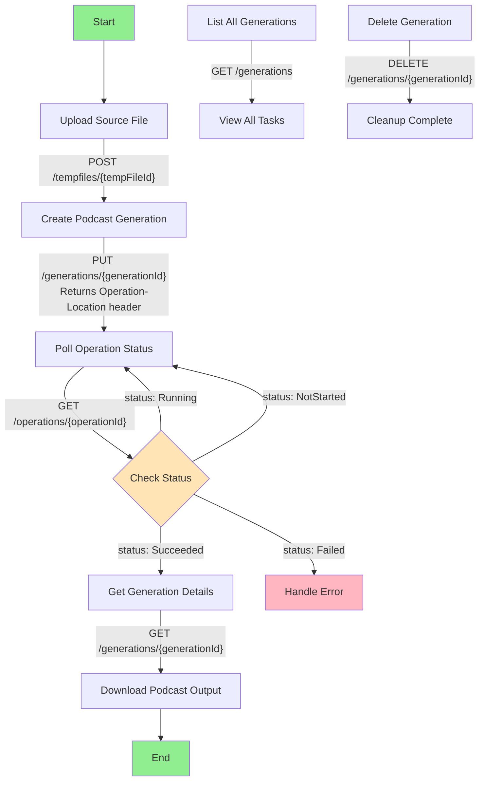

# Podcast API Documentation

## Overview

The Podcast API enables you to generate podcast content from text using AI-powered speech synthesis. The API provides a complete workflow for uploading source content, creating podcast generations, monitoring processing status, and managing your podcast tasks.

**API Version:** `2026-01-01-preview`  
**Base URL:** `https://{region}.api.cognitive.microsoft.com/api/podcast/`  
**Supported Regions:** `westeurope`, `centralus`, `eastus`, `eastus2`, `northcentralus`, `southcentralus`, `westcentralus`, `westus`, `westus2`, `westus3`

## Authentication

All API requests require authentication using your Azure Cognitive Services subscription key:

```http
Ocp-Apim-Subscription-Key: YOUR_SUBSCRIPTION_KEY
```

## API Workflow

The typical workflow for generating a podcast involves these steps:



### Workflow Steps

1. **Upload Source File** (Optional)
   - If your source content is a file, first upload it as a temporary file
   - Use the TempFiles API to upload and get a `tempFileId`
   - Skip this step if providing content via URL or inline text

2. **Create Podcast Generation**
   - Submit a generation request with your content and configuration
   - Specify voice preferences, script generation parameters, and output settings
   - Receive a `generationId` and `Operation-Location` header in the response

3. **Poll Operation Status**
   - Use the `Operation-Location` URL (or `/operations/{operationId}` endpoint) to check processing status
   - Poll periodically (recommended: every 10 seconds) until status is `Succeeded` or `Failed`
   - Status values: `NotStarted`, `Running`, `Succeeded`, `Failed`

4. **Get Generation Details**
   - Once the operation succeeds, query the generation details using `/generations/{generationId}`
   - The response includes download URLs for the generated podcast audio and intermediate files

5. **Download Results**
   - Use the SAS URLs from the generation response to download your podcast audio
   - Optionally download intermediate files like scripts, SSML, or individual audio segments

6. **Manage Generations**
   - List all your generations using `/generations` (with pagination, filtering, sorting)
   - Delete completed or failed generations using `/generations/{generationId}`

## API Reference

Detailed documentation for each API group:

- **[Temporary Files API](./temp-files.md)** - Upload and manage temporary source files
- **[Generations API](./generations.md)** - Create and manage podcast generations
- **[Operations API](./operations.md)** - Monitor long-running operation status

## Quick Start Example

Here's a complete example using cURL:

```bash
# 1. Upload source file (if needed)
curl -X POST "https://westus.api.cognitive.microsoft.com/api/podcast/tempfiles/my-temp-file-123" \
  -H "Ocp-Apim-Subscription-Key: YOUR_KEY" \
  -H "Content-Type: multipart/form-data" \
  -F "file=@article.txt" \
  -F "ExpiresAfterInMins=60"

# 2. Create podcast generation
curl -X PUT "https://westus.api.cognitive.microsoft.com/api/podcast/generations/my-generation-456" \
  -H "Ocp-Apim-Subscription-Key: YOUR_KEY" \
  -H "Content-Type: application/json" \
  -H "Operation-Id: my-operation-789" \
  -d '{
    "locale": "en-US",
    "host": "OneHost",
    "content": {
      "tempFileId": "my-temp-file-123",
      "fileFormat": "PlainText"
    },
    "tts": {
      "voiceName": "en-US-JennyNeural"
    },
    "scriptGeneration": {
      "length": "Medium",
      "style": "Default"
    }
  }'

# 3. Poll operation status (repeat until status is Succeeded or Failed)
curl -X GET "https://westus.api.cognitive.microsoft.com/api/podcast/operations/my-operation-789" \
  -H "Ocp-Apim-Subscription-Key: YOUR_KEY"

# 4. Get generation details (when operation succeeds)
curl -X GET "https://westus.api.cognitive.microsoft.com/api/podcast/generations/my-generation-456" \
  -H "Ocp-Apim-Subscription-Key: YOUR_KEY"
```

## Best Practices

1. **Use Operation-Based Polling**
   - Always use the `Operation-Location` header returned from generation creation
   - Poll the operation status endpoint instead of repeatedly querying the generation endpoint
   - This reduces load and provides real-time status updates

2. **Set Appropriate Polling Intervals**
   - Recommended interval: 10 seconds
   - Avoid polling more frequently than every 5 seconds
   - Implement exponential backoff for long-running operations

3. **Provide Operation-Id Header**
   - Include a unique `Operation-Id` header when creating generations
   - This enables idempotent requests and prevents duplicate creations
   - Use UUIDs or other globally unique identifiers

4. **Handle Temporary Files Lifecycle**
   - Temporary files expire after the specified duration (default: 2 hours)
   - Delete temporary files after successful generation to free up storage
   - Set appropriate expiration times based on your workflow needs

5. **Monitor Quota and Rate Limits**
   - Check response headers for rate limit information
   - Implement retry logic with exponential backoff for 429 (Too Many Requests) responses
   - Monitor your subscription quota usage

## Common Scenarios

### Scenario 1: Generate Podcast from Text File
Upload a text file → Create generation → Poll operation → Download audio

### Scenario 2: Generate Podcast from URL
Create generation with content URL → Poll operation → Download audio  
*(Skip temporary file upload)*

### Scenario 3: Generate with Custom Voice
Specify custom voice name in TTS configuration → Create generation → Poll → Download

### Scenario 4: Two-Host Podcast
Set `host: "TwoHosts"` → Specify two speaker names → Create generation → Poll → Download

## Error Handling

Common error codes and how to handle them:

| Status Code | Error | Solution |
|-------------|-------|----------|
| 400 | Bad Request | Validate request body against API schema |
| 401 | Unauthorized | Check subscription key in `Ocp-Apim-Subscription-Key` header |
| 404 | Not Found | Verify resource ID exists |
| 409 | Conflict | Resource already exists with different properties |
| 429 | Too Many Requests | Implement exponential backoff and retry |
| 500 | Internal Server Error | Retry after a delay; contact support if persists |

## Support

For questions, issues, or feature requests:
- Check the detailed API reference pages linked above
- Review the troubleshooting section in each API reference
- Contact Azure Cognitive Services support

## See Also

- [Temporary Files API Reference](./temp-files.md)
- [Generations API Reference](./generations.md)
- [Operations API Reference](./operations.md)
- [Azure Voice Playground](../../../README.md)
